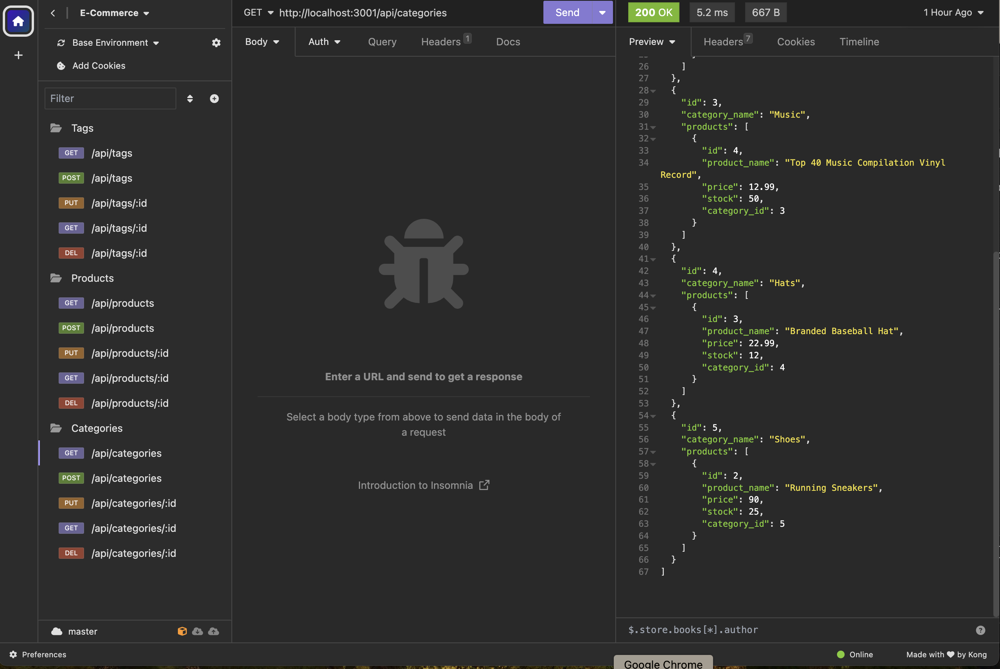

# ORM: E-Commerce Back End

## About this application:

This is the back end app for an e-commerce site. My task was to modify starter code. I configured a working Express.js API to use Sequelize to interact with a MySQL database.

## Demostration video:

Please click this [demo](https://drive.google.com/file/d/19xbKs_1POVDbB5ucWZLPF3llXTVfhLIS/view) to view the a walkthrough video that demonstrates app's functionality and all of the acceptance criteria being met.

## User Story

```md
AS A manager at an internet retail company
I WANT a back end for my e-commerce website that uses the latest technologies
SO THAT my company can compete with other e-commerce companies
```

## Acceptance Criteria

```md
GIVEN a functional Express.js API
WHEN I add my database name, MySQL username, and MySQL password to an environment variable file
THEN I am able to connect to a database using Sequelize
WHEN I enter schema and seed commands
THEN a development database is created and is seeded with test data
WHEN I enter the command to invoke the application
THEN my server is started and the Sequelize models are synced to the MySQL database
WHEN I open API GET routes in Insomnia for categories, products, or tags
THEN the data for each of these routes is displayed in a formatted JSON
WHEN I test API POST, PUT, and DELETE routes in Insomnia
THEN I am able to successfully create, update, and delete data in my database
```

## Installation

- Install Node.js (if you do not have one). Refer to [the website](https://nodejs.org/en) for installation guide
- Run in your terminal `npm i`
- Create .env file and specify your credentials for mySQL. Refer to .env.EXAMPLE file
- Run in your terminal `mysql -u root -p` and enter your MySQL password
- Next run the following command in the terminal:
  `source schema.sql`
- Exit MySQL by typing `exit`
- Seed database by typing `npm run seed` in the terminal

## Usage

- Start server by typing in the terminal `npm start`
- Test API routes in Insomnia Core

## Screenshot:


